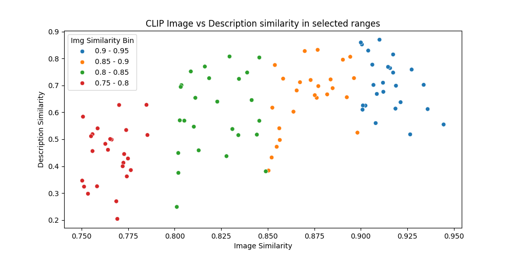
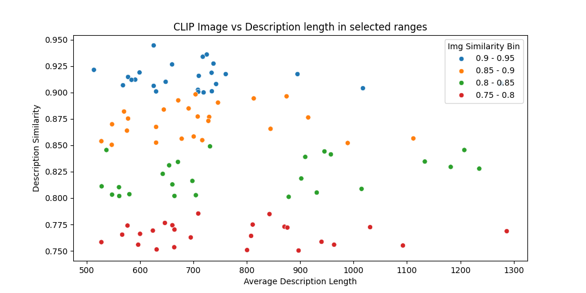

# multimodal-self-consistency

## Introduction

This repository contains the code for the paper CAST: Cross-modal Alignment Similarity Test for Vision Language Models

### Dataset

The dataset is sub-sampled from the [DOCCI](https://google.github.io/docci/) dataset (Onoe et al., 2024) and consists of 100 image pairs.

We select pairs of images that are visually similar and textually interesting. The similarity of the image pairs is determined by the cosine similarity of the image embeddings extracted from CLIP (Radford et al., 2021).





### Requirements

The code is implemented in Python 3.12. To install the required packages, run the following command:

```bash
pip install -r requirements.txt
```

### Run

To run CAST on our generated DOCCI subset, edit the `configs/eval.yaml` with desired configuration and run `python main.py`.
